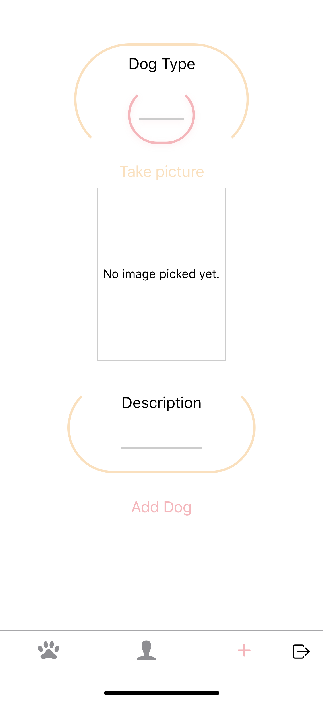
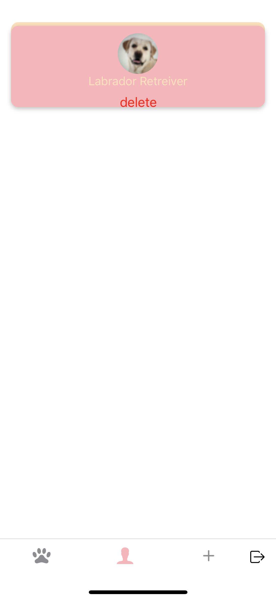
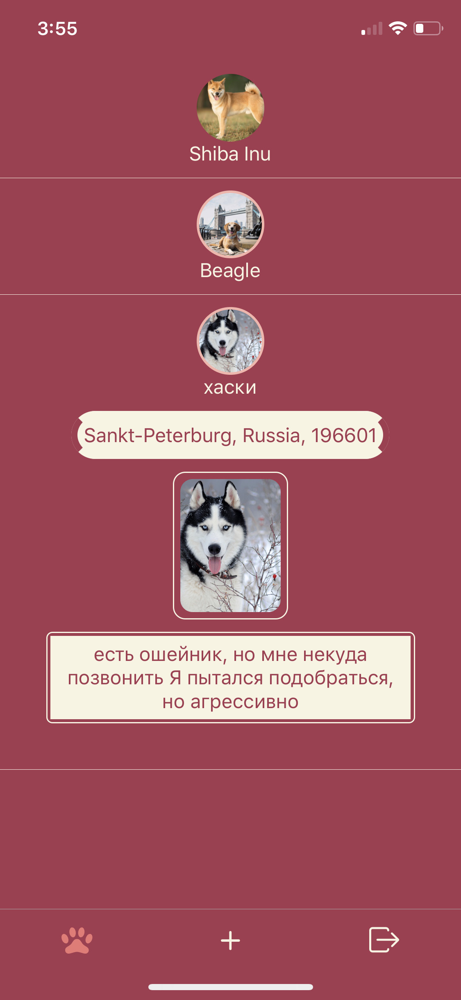
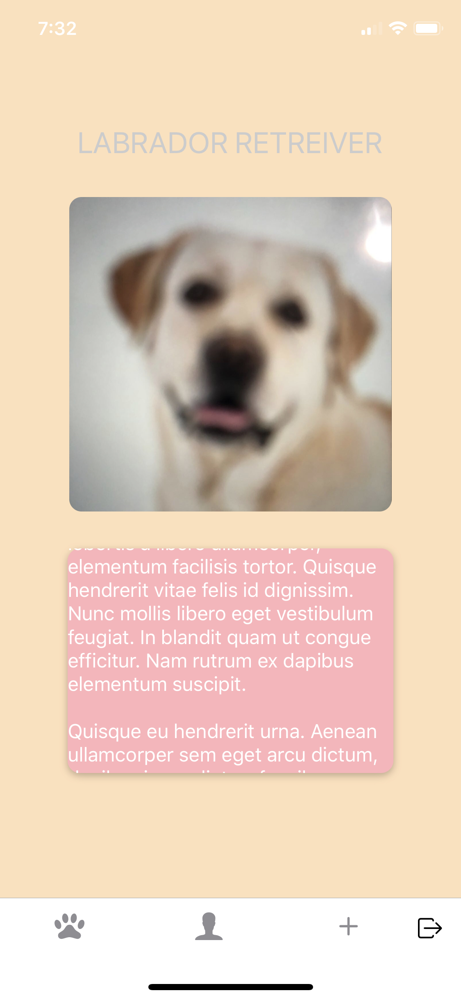

# [Animal Pin Point](https://expo.io/@spacecowboy/animal-pin-point)

## Tools used in this app

> React Native, Firebase, Redux, Cloudinary

## Have you ever seen a lost dog and they didn't have a tag or maybe your dog ran away once and you can't find them?You post your lost dog on social media,put flyers up around the neighbor, hoping that somebody will see a flyer and contact. I built an app designed especially for that purpose if you lost your dog you can check if anybody has posted them.Or maybe you found a dog that doesn't have a tag and you can post them in AnimalPinPoint so that you can reunite them together!

## Login/Sign Up Screen

## Add New Animal Screen

## User Animals Screen

## All Animals Screen

## Animal Detail Screen

